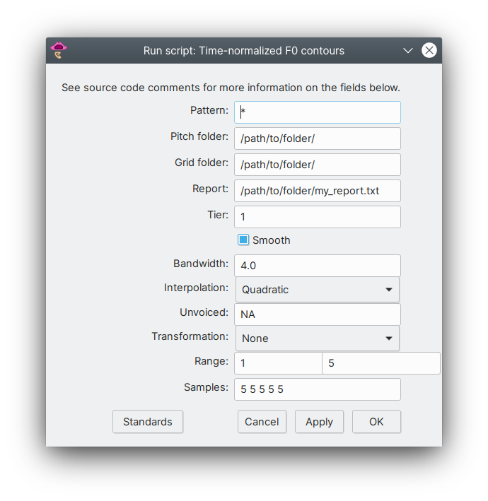

# time-normalized-f0.praat

Praat script to perform time-normalization of F0 contours.

## Purpose

The script will generate a normalized F0 contour from a raw F0 curve. Time normalization is achieved by taking a user-defined number of evenly spaced F0 values for each interval defined in a TextGrid. Usually an interval will span a segment, a syllable or even whole words depending on the problem at hand.

## Input

One or more Pitch files and corresponding TextGrids with at least one interval tier containing non-empty intervals.

## Output

Tab-separated text file containing time-normalized F0 values and metadata for each F0 value: file name, interval number with reference to non-empty intervals, sample number, normalization time step for each interval and timestamp of sampled points.

## Parameters

Upon running the script, a window like the one below will appear, where the user has to set a number of parameters.

The parameters are:

- **Pattern**: Wildcard characters `*` and `?` can be used to specify a pattern that all file names must have in order to be selected. The default option is `*`, which causes the script to work on all the files on the selected folders. If the user wants to select only a subset of the files, a pattern can be specified. For instance, if the user only wants to analyze files whose name start with the string `subj1`, the appropriate pattern would be `subj1*`.
- **Pitch folder** and **Grid folder**: path of folders where *Pitch* and *TextGrid* files are stored. They can be the same or different folders.
- **Report**: Path of the folder and name of the file (with extension) of the report outputted by the script.
- **Tier**: number of the TextGrid tier to be analyzed.
- **Smooth**: allows users to choose whether or not smoothing should be applied to F0 contours.
- **Bandwidth**: how much smoothing should be applied (the greater the number, the smoother the contour).
- **Interpolation**: Which kind of interpolation apply in voiceless intervals. Options are quadratic, linear or no interpolation.
- **Unvoiced**: the user can select what string will be used when the script samples an unvoiced part of the F0 contour. The default value is `NA`, which is the string used by R to represent missing values.
- **Transformation**: options to transform the F0 values from the Hz scale to semitones relative to different reference levels, the OctaveMedian scale or z-score normalization. 
- **Interval range**: indices of the first and last intervals in the specified tier to be sampled. The value on the right field has to be equal or greater than the value on the left field.
- **Samples**: number of samples taken in each surveyed interval. Each interval can have a different number. If just one value is provided, that number will be used for all intervals. Use one whitespace to separate values.

## Transformation

Scale transformation can be useful if the user wants to minimize between-speaker variability, specially those due to speaker sex differences (female versus male speakers).

Value conversion is performed on the Hertz values taken from the smoothed contour if this option is selected by the user.

The options are listed below:

- **None**: no transformation is applied to the Hertz values.
- **Semitones re 1 Hz**: Hertz values are converted to semitones relative to 1 Hz.
- **Semitones re 100 Hz**: Hertz values are converted to semitones relative to 100 Hz.
- **Semitones re 200 Hz**: Hertz values are converted to semitones relative to 200 Hz.
- **Semitones re minimum f0**: Hertz values are converted to semitones relative to the minimum Hz value in the whole contour. See below.
- **OctaveMedian**: Hertz values are converted to the Octave-Median (OMe) scale. See below.
- **Z-score**: Hertz values are converted to _z_-scores. See comments below.

Conversion to semitones relative to 1, 100 and 200 Hz are common in the literature. Semitones re minimum f0 is suggested by Plag et al. (2011).

Octave-Median (OMe) is a scale proposed by De Looze and Hirst (2014) and values are obtainded by applying the following formula: log2(f0Hz / f0med), where f0Hz is one f0 value in Hertz and f0med is the median f0 of the whole contour.

The _z_-score of each f0 value in Hertz is obtained by applying the following formula: (f0Hz - f0mean) / f0sd, where f0Hz is one f0 value in Hertz, f0mean and f0sd  are the mean and standard deviation of all values in the contour being analyzed.

## Tutorial

A tutorial describing use cases were it would be appropriate to use time-normalization and how to do it using the script can be found at:

Arantes, P. (2015). Time-normalization of fundamental frequency contours: a hands-on tutorial. In A. R. Meireles (Ed.), *Courses on Speech Prosody*, pp. 98-123. Newcastle upon Tyne: Cambridge Scholars Publishing.

A prefinal draft of this document can be found [here](https://www.researchgate.net/publication/281595102_Time-normalization_of_fundamental_frequency_contours_a_hands-on_tutorial) or upon request to the author.

R code and data file referred to in the text can be found [here](case-study/).

## How to cite

Click on the DOI badge above to see instructions on how to cite the script.

## License

See the [LICENSE](LICENSE.md) file for license rights and limitations.

## References

De Looze, Céline, and Daniel J. Hirst. 2014. "The OMe (Octave-Median) Scale: A Natural Scale for Speech Melody." In Proceedings of the 7th International Conference on Speech Prosody, edited by N. Campbell, D. Gibbon, and D. Hirst, 910–14. Dublin.

Plag, Ingo, Gero Kunter, and Mareile Schramm. 2011. "Acoustic Correlates of Primary and Secondary Stress in North American English." Journal of Phonetics 39 (3): 362–74.